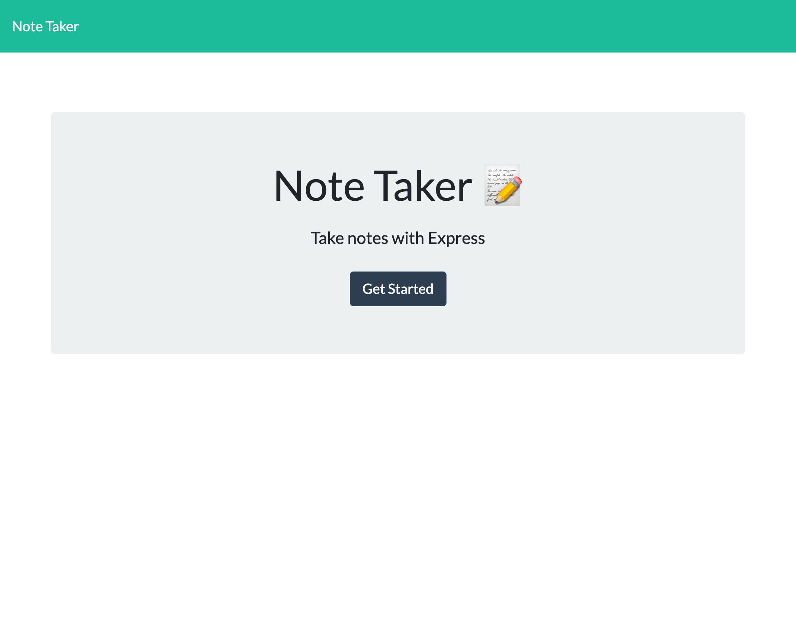
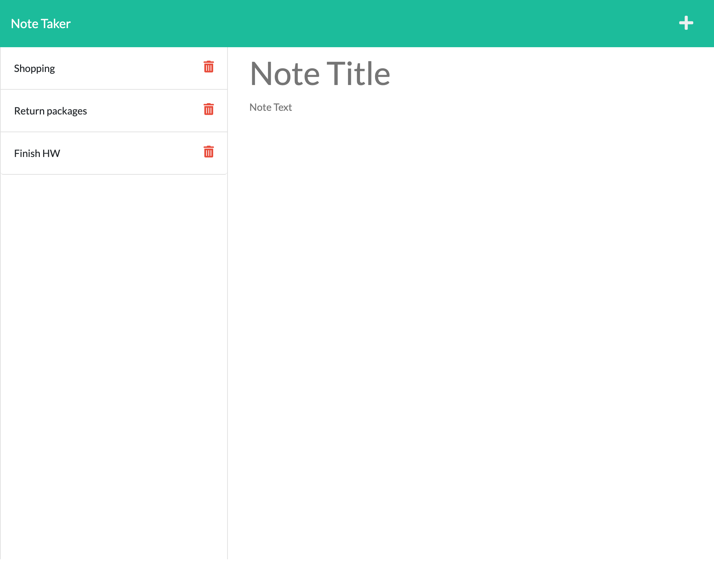

# Note Taker

## Description

This application can be used to write, save and delete notes. This application uses an Express.js back end and will save and retrieve note data from a JSON file.

## Usage 

* This is a note-taking application where after the user opens the Note Taker, a landing page is presented with a link to a notes page.
* When the link to the notes page is clicked, the user is presented with a page with existing notes (if previously added) which are listed in the left-hand column. There are also empty fields to enter a new note title and the note’s text in the right-hand column.
* When a new note title and the note’s text are entered, a Save icon will appear in the navigation at the top of the page.
* When the Save icon is clicked, the new note that has been entered is saved and appears in the left-hand column with the other existing notes.
* When an existing note is clicked in the list in the left-hand column, that note appears in the right-hand column.
* When the Write icon is clicked in the navigation at the top of the page, the user is presented with empty fields to enter a new note title and the note’s text in the right-hand column.
* When the delete icon is clicked on an old note, the note is deleted from the page.

## Preview

View the live application here: https://frozen-tor-58816.herokuapp.com/

The following images show the web application's appearance and functionality:

GitHub Repository: https://github.com/mich-hales/note-taker
